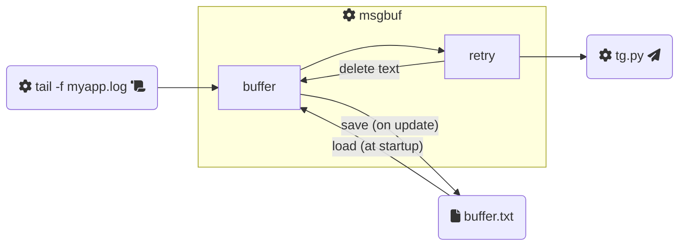

# msgbuf

:snake: A Python **message buffer**.

I developed this for a specific reason: being able to **aggregate multiple log lines** in a single _Telegram_ message to receive **notifications from my application** log files.

- TODO fix project structure and content
- TODO fix README structure and content

```bash
python3 fake-tail.py | python3 msgbuf.py -lDEBUG -i1 -m10 -fbuffer.txt python3 fake-notifier.py

cat /etc/motd | python3 tg.py <bot_token> <chat_id>
```


