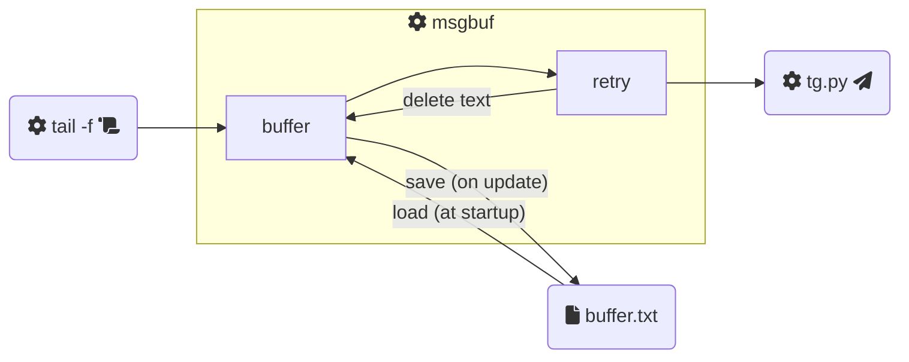

# msgbuf

[](https://pypi.org/project/msgbuf/)

:snake: A Python **message buffer**.

I developed this for a specific reason: being able to **aggregate multiple log lines** in a single _Telegram_ message to receive **notifications from my application** log files.

## Installation

This utility is available as a Python package on **PyPI**:

```bash
pip3 install msgbuf
```

## Usage

This tool reads text from the **standard input** (`stdin`) stream and divides it into **chunks**. Then, for each chunk, a **notifier** command is invoked on a separate thread.

As a sample notifier command we have the [`tg.py`](example/tg.py) script, which reads all the standard input until its end and sends the content to a _Telegram_ user (as a bot). For example, we can use it like this:

```bash
cat /etc/motd | python3 example/tg.py <bot_token> <chat_id>
```

So a full usage example of **msgbuf** can be:

```bash
tail -f /var/log/my-log-file | msgbuf -fbuffer.txt python3 example/tg.py <bot_token> <chat_id>
```

This is a simple graphical representation of what happens when we run the shell line above:



:information_source: For more details on how to use this command, you can also refer to the help message (`msgbuf --help`).

## Development

If you want to contribute to this project, you can install the package in **editable** mode:

```bash
pip3 install -e . --user
```

This will just link the package to the original location, basically meaning any changes to the original package would reflect directly in your environment ([source](https://stackoverflow.com/a/35064498)).

Then, during development, you can test the tool's behaviour using the [`fake-tail.py`](test/fake-tail.py) and [`fake-notifier.py`](test/fake-notifier.py) scripts:

```bash
python3 test/fake-tail.py | msgbuf -lDEBUG -i1 -m10 -fbuffer.txt python3 test/fake-notifier.py
```
