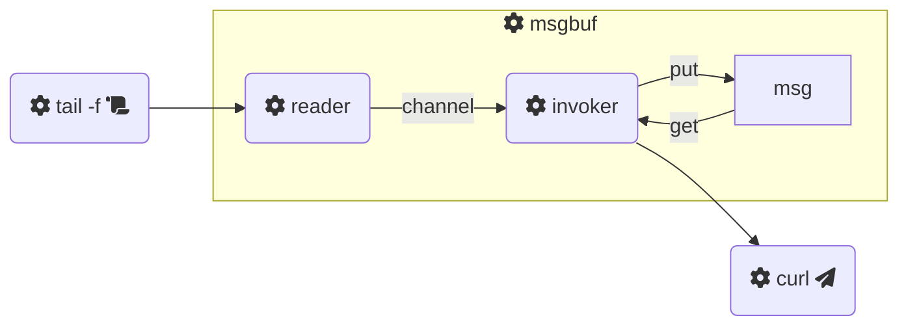

# msgbuf

:crab: A standalone **message buffer** application.

This tool reads text from the **standard input** (`stdin`) stream and divides it into chunks, called "**messages**". Then, for each message, a **notifier** command is invoked on a separate thread.

## Installation

Pre-built binaries are available. You can download the latest version with:

```bash
curl -Lo msgbuf "https://github.com/dmotte/msgbuf/releases/latest/download/msgbuf-$(uname -m)-unknown-linux-gnu"
chmod +x msgbuf
```

## Usage

As a sample notifier command we can use _cURL_ to send the text to a _Telegram_ user (as a bot). Example:

```bash
tail -f /var/log/my-log-file | ./msgbuf -- curl -sSXPOST "https://api.telegram.org/bot.../sendMessage" -dchat_id=... --data-urlencode text@- --fail-with-body -w'\n'
```

This is a simple graphical representation of what happens when we run the shell line above:



> **Note**: for more information on how to use this tool, you can also refer to the help message (`./msgbuf --help`).
