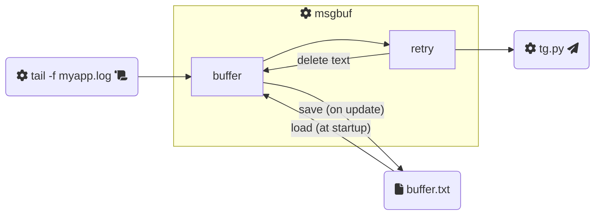

# msgbuf

[](https://pypi.org/project/msgbuf/)

:snake: A Python **message buffer**.

I developed this for a specific reason: being able to **aggregate multiple log lines** in a single _Telegram_ message to receive **notifications from my application** log files.

## Installation

This utility is available as a Python package on **PyPI**:

```bash
pip3 install msgbuf
```

## Usage

TODO

```bash
python3 fake-tail.py | msgbuf -lDEBUG -i1 -m10 -fbuffer.txt python3 fake-notifier.py

cat /etc/motd | python3 tg.py <bot_token> <chat_id>
```



:information_source: For more details on how to use this command, you can also refer to the help message (`msgbuf --help`).

## Development

If you want to contribute to this project, you can install the package in **editable** mode:

```bash
pip3 install -e . --user
```

This will just link the package to the original location, basically meaning any changes to the original package would reflect directly in your environment ([source](https://stackoverflow.com/a/35064498)).
